# Test Results for Water Customers App

## 1. Welcome Screen

### Test Case 1: Verify Form Elements

- **Status:** PASS
- **Result:** All form elements are displayed correctly.
- **Screenshot: Form Elements** 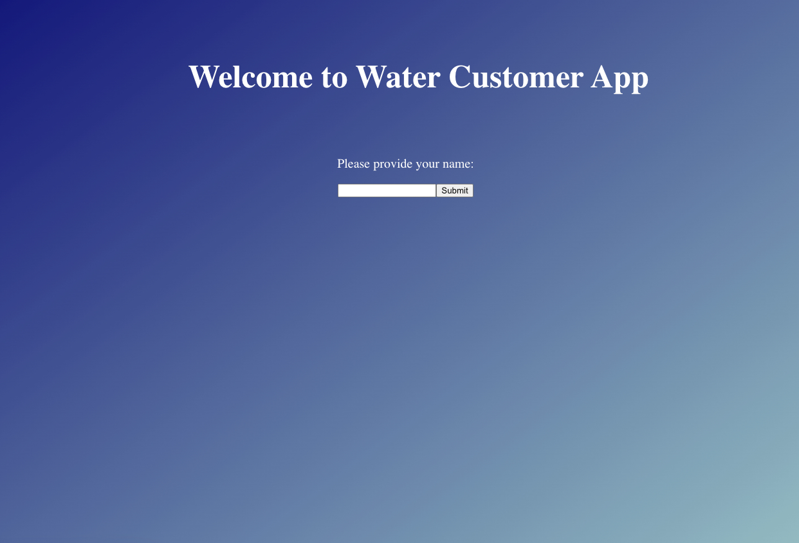

### Test Case 2: Submit Form with Valid Name

- **Status:** PASS
- **Result:** The Customer List Screen is displayed as expected.
- **Screenshot 1: Name Input** 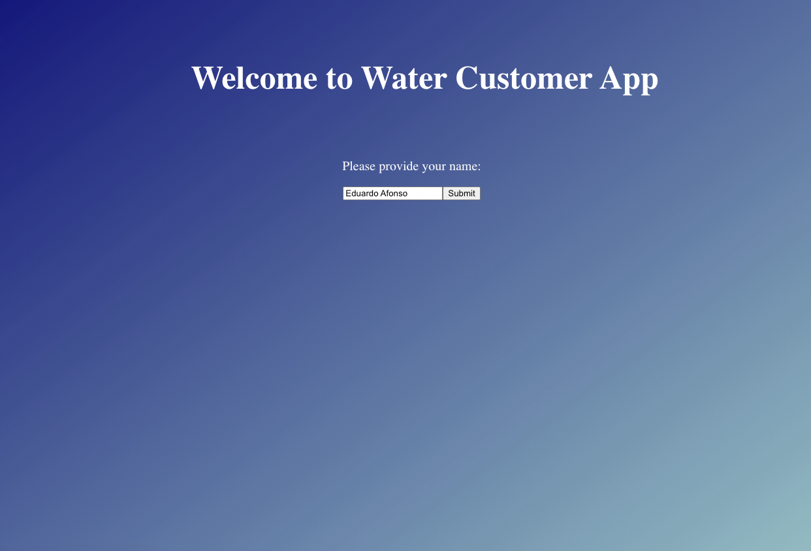
- **Screenshot 2: Valid Name Submission** 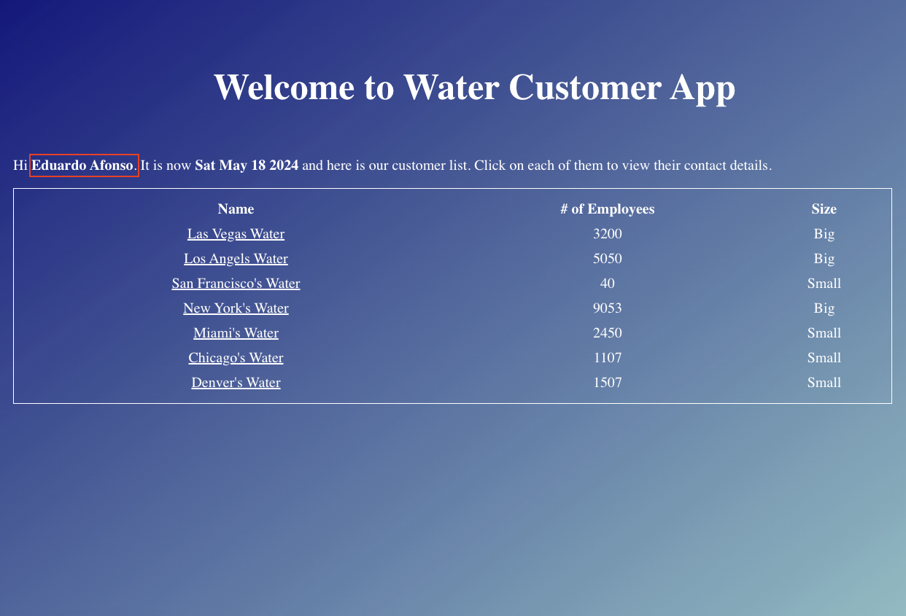

### Test Case 3: Submit Form with Empty Name

- **Status:** PASS
- **Result:** Alert message "Please provide your name" is displayed as expected.
- **Screenshot: Empty Name Alert** 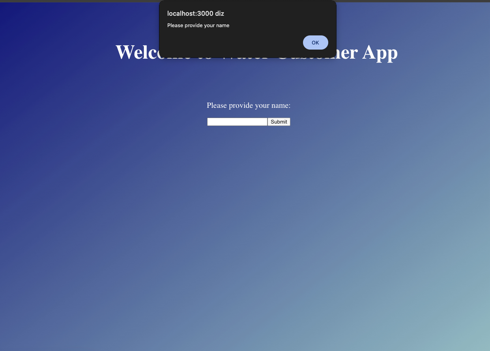

## 2. Customer List Screen

### Test Case 4: Verify Customer List Display

- **Status:** PASS
- **Result:** The list of customers is displayed correctly.
- **Screenshot: Customer List Display** 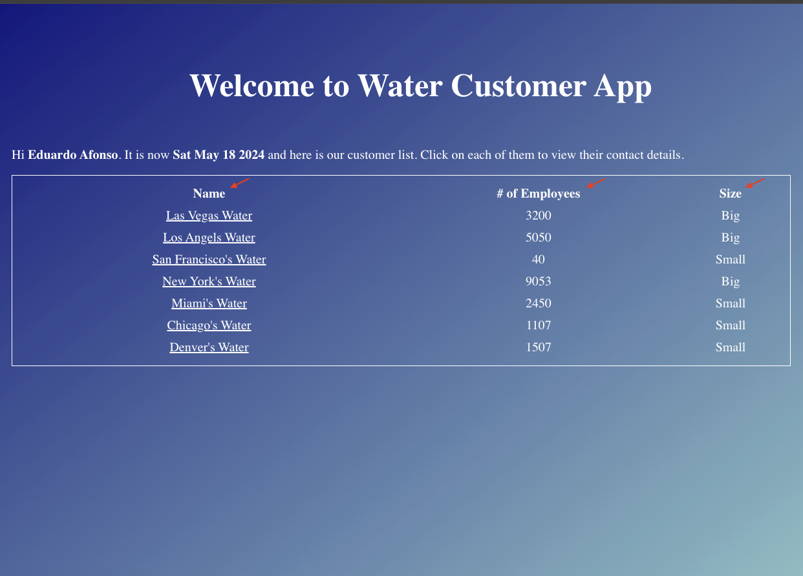

### Test Case 5: Customer Size Calculation

- **Status:** FAIL
- **Result:** The list of customers is displayed, but the size categorization is incorrect for the customer "Las Vegas Water" with 3200 employees, it should be categorized as "Medium" size but is listed as "Big".
- **Screenshot: Customer Size Calculation** 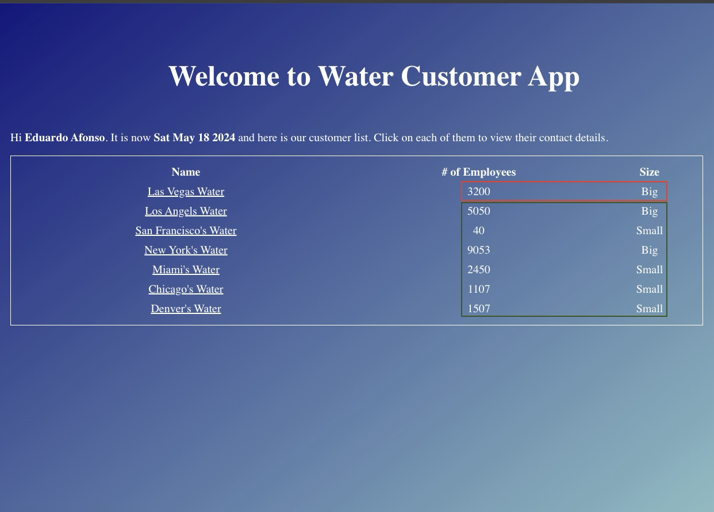

### Test Case 6: Click on Customer Name

- **Status:** PARTIAL PASS
- **Result:** Clicking on most customers' names shows the Contacts Detail Screen, but clicking on "Denver's Water" customer shows a screen without any text or details.
- **Comment:** The "Denver's Water" customer object does not have the "contactInfo" object, which might be causing the application to fail when trying to display customer details.
- **Recommendation:** Modify the application to handle missing "contactInfo" objects and display a message indicating the absence of contact information.
- **Screenshot 1: Las Vegas Water Click Success Example** 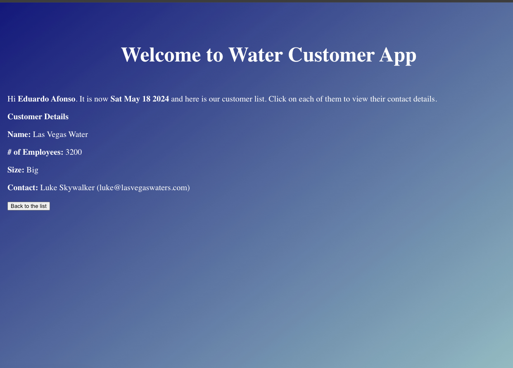
- **Screenshot 2: Screen after clicking on Denver's Water** 
- **Screenshot 3: Possible cause of the error** 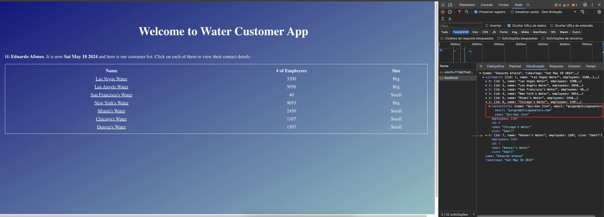

## 3. Contacts Detail Screen

### Test Case 7: Verify Customer Details Display

- **Status:** FAIL
- **Result:** Most customers' names show their details as expected, but the "New York's Water" customers do not bring the contact person's name, only the e-mail. And it's not possible to verify the details for the customer "Denver's Water", given the problem in Test Case 6.
- **Screenshot 1: Las Vegas Water Details Success Example** 
- **Screenshot 2: New York's Water Details Fail** 
- **Screenshot 3: Screen after clicking on Denver's Water** 
- **Screenshot 4: Possible cause of the error** 

### Test Case 8: Verify Contact Information Display

- **Status:** FAIL
- **Result:** The customer "Denver's Water" should present the message "No contact info available" since it is the only customer with no full contact information. However, clicking on their name shows a screen without any text or details.
- **Comment:** It's not clear in the requirements that "New York's Water" customer should display this message too because it has only partial contact information.
- **Screenshot 1: Screen after clicking on Denver's Water** 
- **Screenshot 2: Possible cause of the error** 

### Test Case 9: Click on "Back to the list" Button

- **Status:** PASS
- **Result:** After clicking the button "Back to the list" the Customer List Screen is displayed as expected.
- **Screenshot 1: Back to List Button** 
- **Screenshot 2: Back to List** 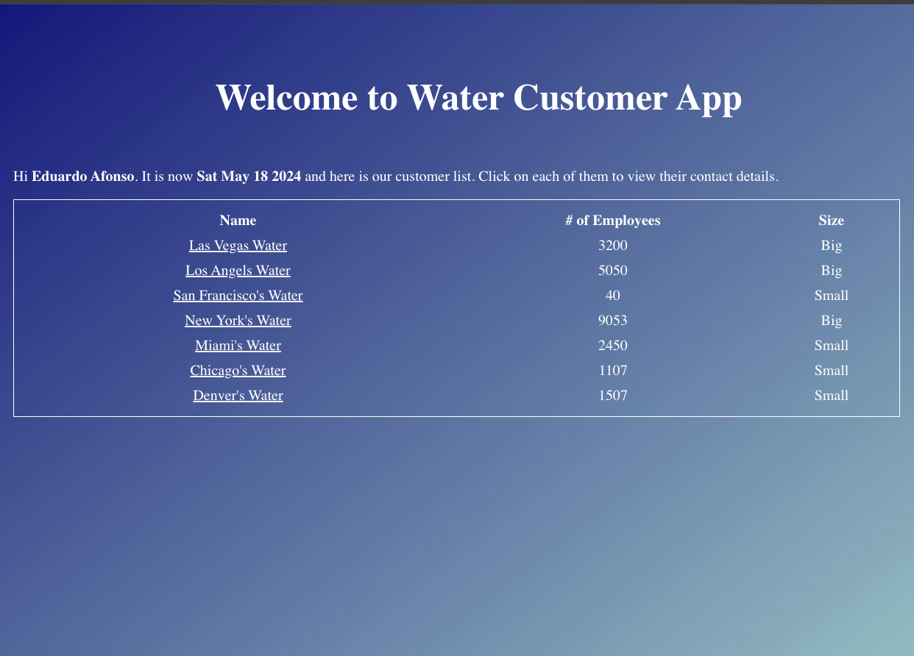

## 4. API Tests

### Test Case 10: POST Request with Valid Name

- **Comment:** Since the "contactInfo" object should only be included if there is contact information available, I will assume that within the "contactInfo" object, the name and email fields are optional and can be included partially.
- **Status:** PASS
- **Result:** The response status code is "200 OK", and the response body contains the correct user name, timestamp, and customer details as specified.
- **Screenshot: Api Valid Name** 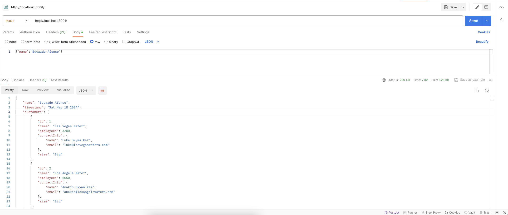

  ### Test Case 11: POST Request with Empty Name

- **Comment:** The "name" field is required in the frontend. Therefore, an empty name should result in an error response from the API.
- **Status** FAIL
- **Result** The response status code is "200 OK", but the response status code should be "400 Bad Request", and the response body should contain the error message "Please provide your name".
- **Recommendation:** Update the API to validate the "name" field. If the field is empty, the API should return a "400 Bad Request" status with an appropriate error message.
- **Screenshot: Api Empty Name** 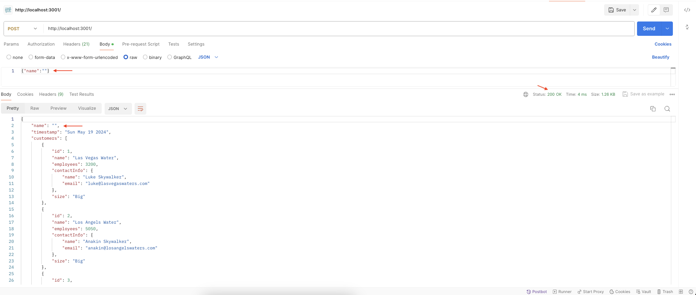

### Test Case 12: POST Request with Blank Request Body

- **Comment:** The request body should not be blank. The API should validate the presence of required fields and return an appropriate error response if the request body is missing or empty.
- **Status** FAIL
- **Result** The response status code is "200 OK", but the response status code should be "400 Bad Request", and the response body should contain an error message indicating that the request body is required.
- **Recommendation:** Update the API to validate the request body. If the request body is blank, the API should return a "400 Bad Request" status with an appropriate error message.
- **Screenshot: Api Blank Request** 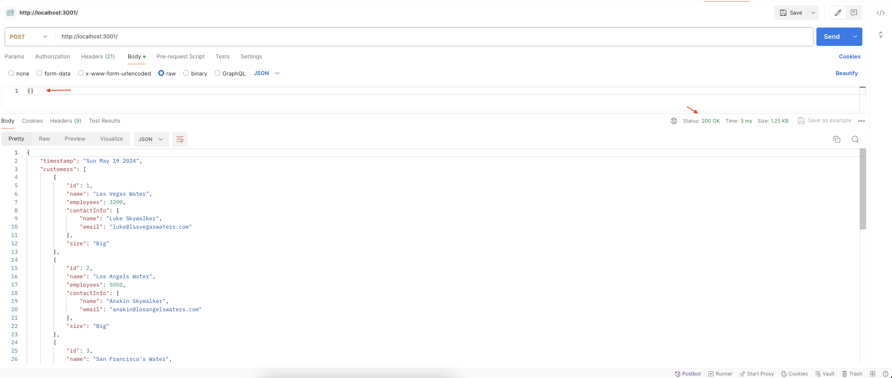

### Test Case 13: POST Request Without Contact Info

- **Status:** PASS
- **Result:** The response status code is "200 OK", and the response body contains the correct user name, timestamp, and customer details, with the "contactInfo" field omitted for customers without contact information.
- **Comment:** The customer data is assumed based on the specifications provided.
- **Screenshot: Api Without Contact Information** 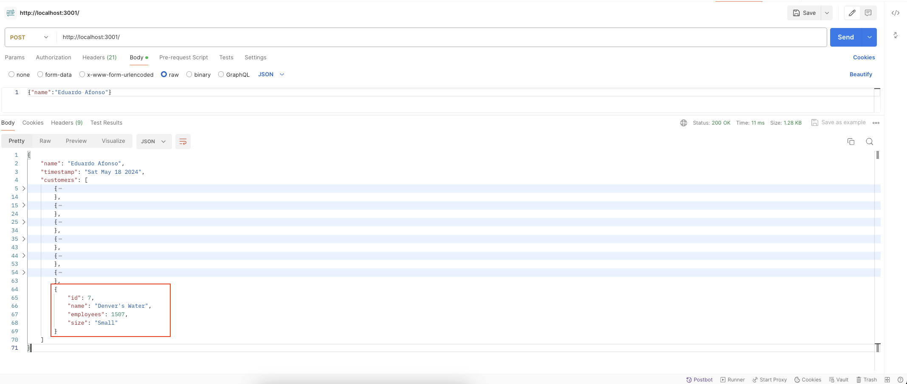

### Test Case 14: POST Customer Size Calculation

- **Status:** FAIL
- **Result:** The size categorization is incorrect for the customer "Las Vegas Water" with 3200 employees, it should be categorized as "Medium" size but is listed as "Big".
- **Screenshot: Api Customer Size Calculation** 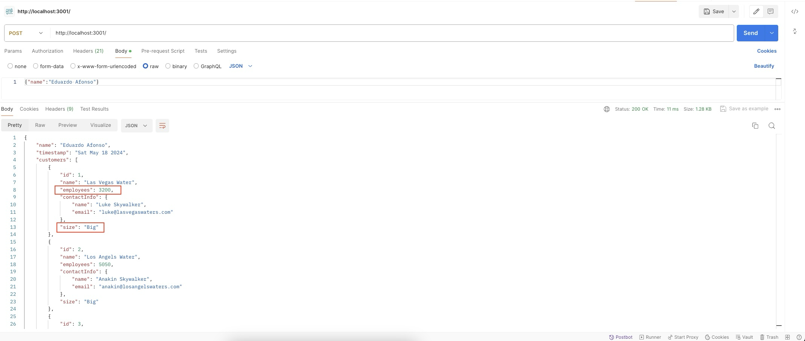
