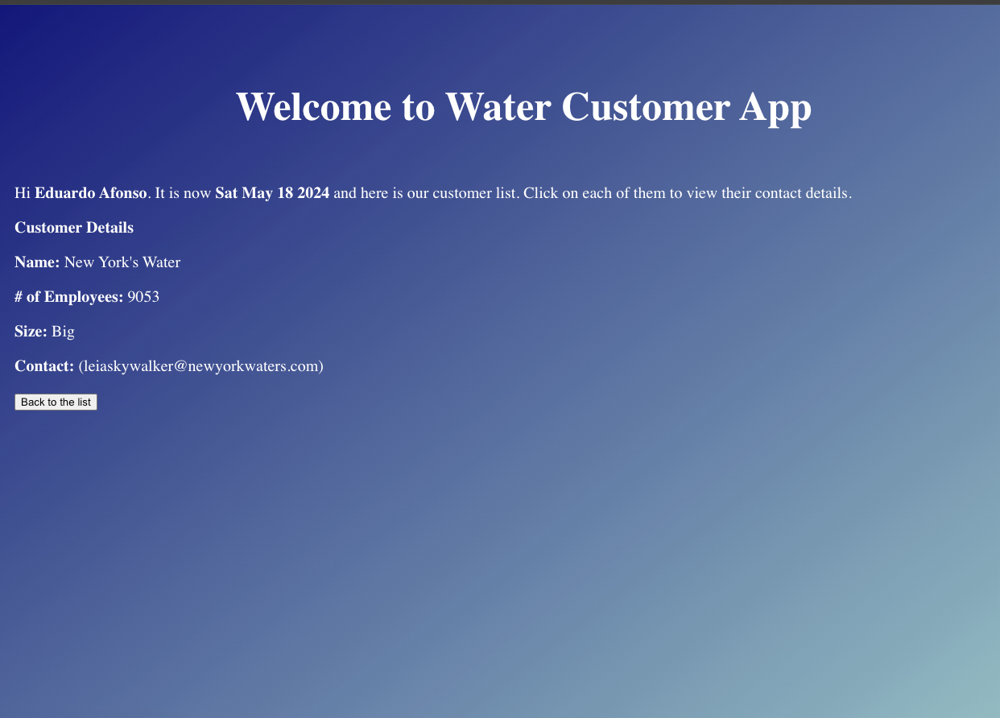
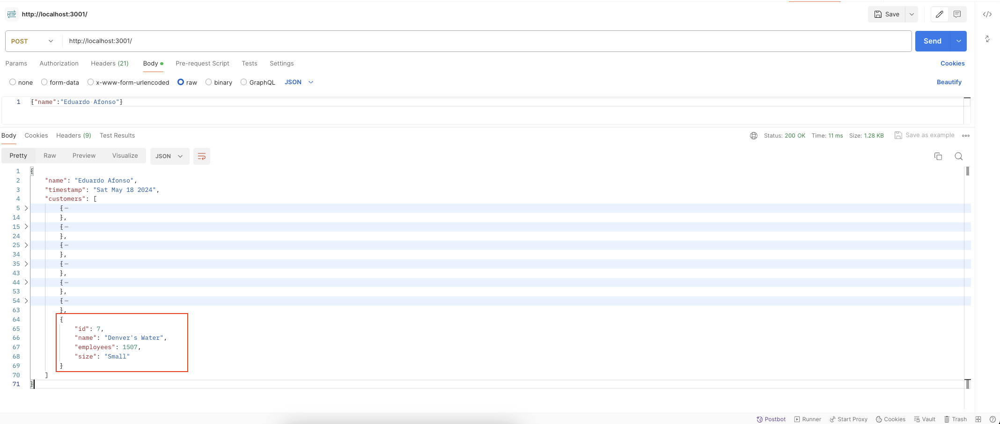
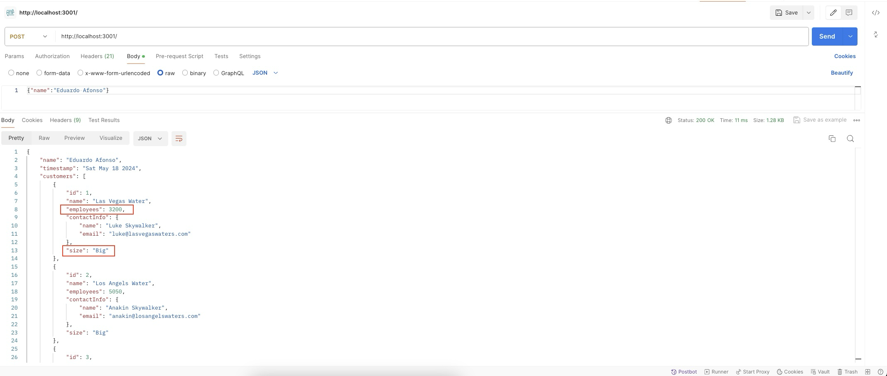

# Test Results for Water Customers App

## 1. Welcome Screen

### Test Case 1: Verify Form Elements

- **Status:** PASS
- **Result:** All form elements are displayed correctly.
- **Screenshot:** Form Elements 

### Test Case 2: Submit Form with Valid Name

- **Status:** PASS
- **Result:** The Customer List Screen is displayed as expected.
- **Screenshot 1:** Name Input
- **Screenshot 2:** Valid Name Submission 

### Test Case 3: Submit Form with Empty Name

- **Status:** PASS
- **Result:** Alert message "Please provide your name" is displayed as expected.
- **Screenshot:** Empty Name Alert 

## 2. Customer List Screen

### Test Case 4: Verify Customer List Display

- **Status:** PASS
- **Result:** The list of customers is displayed correctly.
- **Screenshot:** Customer List Display 

### Test Case 5: Customer Size Calculation

- **Status:** FAIL
- **Result:** The list of customers is displayed, but the size categorization is incorrect for the customer "Las Vegas Water" with 3200 employees, it should be categorized as "Medium" size but is listed as "Big".
- **Screenshot:** Customer Size Calculation 

### Test Case 6: Click on Customer Name

- **Status:** PARTIAL PASS
- **Result:** Clicking on most customers' names shows their details as expected, but clicking on "Denver's Water" customer shows a screen without any text or details.
- **Probable Cause:** The "Denver's Water" customer object does not have the "contactInfo" object, which might be causing the application to fail when trying to display customer details.
- **Recommendation:** Modify the application to handle missing "contactInfo" objects and display a message indicating the absence of contact information.
- **Screenshot:** Probable Cause 
- **Screenshot:** Screen after clicking on Denver's Water 
- **Screenshot:** Las Vegas Water Click Success 
- **Screenshot:** Los Angels Water Click Success 
- **Screenshot:** San Francisco's Water Click Success 
- **Screenshot:** New York's Water Click Success 
- **Screenshot:** Miami's Water Click Success 
- **Screenshot:** Chicago's Water Click Success 

## 3. Contacts Detail Screen

### Test Case 7: Verify Customer Details Display

- **Status:** PARTIAL PASS
- **Result:** Most customers' names shows their details as expected, but unable to verify the details for the customer "Denver's Water", clicking on their name shows a screen without any text or details.
- **Probable Cause:** Same cause as in Test Case 6.
- **Screenshot:** Probable Cause 
- **Screenshot:** Screen after clicking on Denver's Water 
- **Screenshot:** Las Vegas Water Details Success 
- **Screenshot:** Los Angels Water Details Success 
- **Screenshot:** San Francisco's Water Details Success 
- **Screenshot:** New York's Water Details Success 
- **Screenshot:** Miami's Water Details Success 
- **Screenshot:** Chicago's Water Details Success 

### Test Case 8: Verify Contact Information Display

- **Status:** FAIL
- **Result:** The customer "Denver's Water" should present the message "No contact info available" since is the only customer with no contact information, but clicking on their name shows a screen without any text or details.
- **Probable Cause:** Same cause as in Test Case 6.
- **Screenshot:** Probable Cause 
- **Screenshot:** Screen after clicking on Denver's Water 

### Test Case 9: Click on "Back to the list" Button

- **Status:** PASS
- **Result:** After clicking the button "Back to the list" the Customer List Screen is displayed as expected.
- **Screenshot:** Back to List Button 
- **Screenshot:** Back to List 

## 4. API Tests

### Test Case 10: POST Request with Valid Name

- **Status:** PASS
- **Result:** The response status code is "200 OK", and the response body contains the correct user name, timestamp, and customer details as specified.
- **Screenshot:** Api Valid Name 

### Test Case 11: POST Request Without Contact Info

- **Status:** PASS
- **Result:** The response status code is "200 OK", and the response body contains the correct user name, timestamp, and customer details, with the "contactInfo" field omitted for customers without contact information.
- **Comment:** The customer data is assumed based on the specifications provided.
- **Screenshot:** Api Without Contact Information 

### Test Case 12: POST Customer Size Calculation

- **Status:** FAIL
- **Result:** The size categorization is incorrect for the customer "Las Vegas Water" with 3200 employees, it should be categorized as "Medium" size but is listed as "Big".
- **Screenshot:** Back to List Button 
